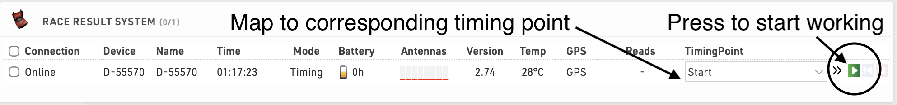

# Configure the RaceResult Event Beta

## 1. Open the target event

In RaceResult, open the event you wish to connect to OpenSplitTime.

## 2. Configure timing points

In the left panel, go to **Timing** → **Settings** → **Timing Points** and configure the Timing Points so the names match exactly with aid station names in OpenSplitTime.

## 3. Connect and map decoders

Connect your RaceResult decoders to the RaceResult platform and map each decoder to the corresponding **Timing Points**. You can map decoders at **Timing** → **Chip Timing** → **Systems**.

Make sure each decoder is actively logging by pressing the green triangle.

