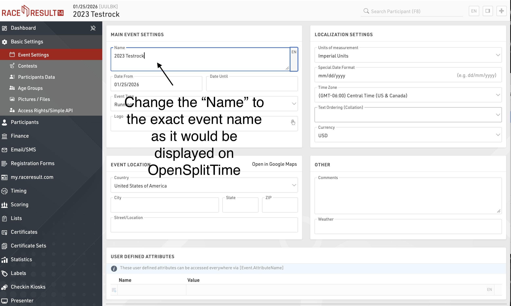

# RaceResult Webhook Configuration

Follow these steps to connect a RaceResult event to OpenSplitTime.

## 1. Open the target event

In RaceResult, open the event you wish to connect to OpenSplitTime.

## 2. Set the event name

In the left panel, go to `Basic Settings` → `Event Settings`. Change the `Name` field to the full event name shown in OpenSplitTime, for example `2023 Testrock`.

## 3. Configure timing points

In the left panel, go to `Timing` → `Settings` → `Timing Points` and configure the Timing Points so the names match exactly with aid station names in OpenSplitTime.

## 4. Connect and map decoders

Connect your RaceResult decoders to the RaceResult platform and map each decoder to the corresponding `Timing Points`. You can map decoders at `Timing` → `Chip Timing` → `Systems`. Make sure each decoder is actively logging by pressing the green triangle.

## 5. Create an exporter

In the left panel, go to `Timing` → `Settings` → `Exporters + Tracking`. Add a new `Exporter` with the following settings:

- **Name**: OST Webhook
- **TimingPoint/Split**: <All Timing Points>
- **Filter**: Leave as blank
- **Destination**: HTTP(S) Post, then fill the next field with the following endpoint URL: `https://staging.opensplittime.org/webhooks/raceresult`
- **Export Data**: Custom, then fill the next field with `[RD_RecordJSON] & ";" & [Event.Name]`
- **LineEnd**: CRLF

A sample configuration is shown below. Make sure to replace the URL and exported data with the values specified above.

## 6. Activate the exporter

In the left panel, go to `Timing` → `Chip Timing` → `Chip Timing`. Under the `Exporters + Tracking` section, locate the exporter created in the previous step and activate it by pressing the green triangle button.

## 7. Confirm live delivery

RaceResult should now be connected to the OST backend and send data to the server every time there is an update.
