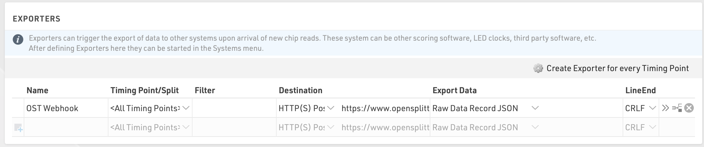
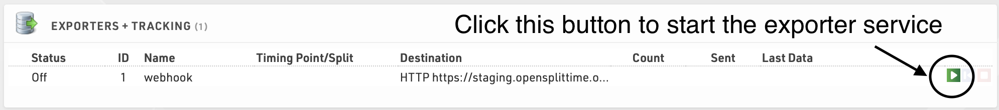

# RaceResult Webhook Configuration Beta

Follow these steps to connect a RaceResult event to OpenSplitTime.

## 1. Open the target event

In RaceResult, open the event you wish to connect to OpenSplitTime.

## 2. Configure timing points

In the left panel, go to **Timing** → **Settings** → **Timing Points** and configure the Timing Points so the names match exactly with aid station
names in OpenSplitTime.

## 3. Connect and map decoders

Connect your RaceResult decoders to the RaceResult platform and map each decoder to the corresponding **Timing Points**. You can map decoders 
at **Timing** → **Chip Timing** → **Systems**. Make sure each decoder is actively logging by pressing the green triangle.

## 4. Find your OpenSplitTime webhook token

In OpenSplitTime, make sure you are logged in and go to your Event Group. Click **Admin** → **Construction** → **Status**. In the **Accept RaceResult
Webhooks** card, if a webhook token has not yet been generated, click **Set Token** to generate one. Once a token exists, the **Webhook URL** 
and **Post Body Expression** fields will be displayed. You will need both of these values in the next step.

## 5. Create an exporter

In the left panel of RaceResult, go to **Timing** → **Settings** → **Exporters + Tracking**. Add a new **Exporter** with the following settings:

- **Name**: OST Webhook (or whatever name you prefer)
- **TimingPoint/Split**: <All Timing Points>
- **Filter**: Leave as blank
- **Destination**: HTTP(S) Post, then copy the **Webhook URL** from the OpenSplitTime setup summary page into the next field. The URL will look something like this:

  `https://opensplittime.org/webhooks/raceresult?token=abc123def456`

- **Export Data**: Custom, then copy the **Post Body Expression** from the OpenSplitTime setup summary page into the next field. The post body will look something like this:

  `'{"record": ' & [RD_RecordJSON] & ', "event_group_name": "my-event-group"}'`
- **LineEnd**: CRLF

### A sample configuration is shown below:

## 6. Activate the exporter

In the left panel, go to **Timing** → **Chip Timing** → **Chip Timing**. Under the **Exporters + Tracking** section, locate the exporter created in
the previous step and activate it by pressing the green triangle button.

## 7. Confirm RaceResult is receiving data

Verify that your decoders are actively sending data to the RaceResult platform. In the left panel, go to **Timing** → **Chip Timing** → **Chip Timing** and confirm that readings are appearing as chips are scanned.

## 8. Confirm OpenSplitTime is receiving data

In OpenSplitTime, make sure Live Entry is enabled for your Event Group (on the **Status** page, click **Enable Live Entry** if it is not already enabled). Then go to **Live Times** → **List** and watch for raw times to appear as they are received from RaceResult.
